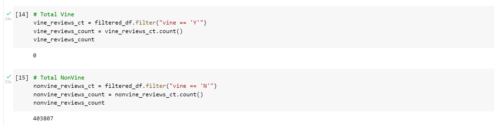
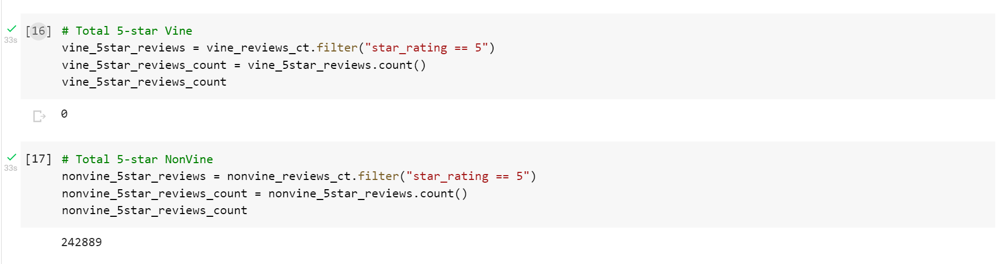
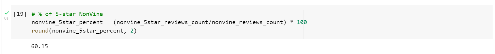

# Amazon Vine Analysis

# Overview
The purpose of this project is to analyze Amazon reviews written by members of the paid Amazon Vine program. The goal of the analysis is to determine if there is any positive bias for reviews in the Vine program.

# Resources
Data Set
* [Amazon Reviews US Books v1_02](https://s3.amazonaws.com/amazon-reviews-pds/tsv/index.txt "Amazon Reviews US Books v1_02")

Software
* AWS S3 and RDS
* Google Colab
* PySpark
* PostgreSQL

# Amazon Vine Analysis Results
The results of the analysis fall into three categories. count the reviews for both Vine and Non-Vine reviews, count the 5-star reviews for both groups of reviews, and calcuate the percentage of 5-star reviews. 

## How many Vine reviews and non-Vine reviews were there?

The original dataset was filtered to gather the best reviews.  First, to show only reviews with more than 20 total votes. Second, where the number of helpful_votes divided by total_votes is equal to or greater than 50%. Last, the new dataset was sorted into two groups, Vine and Non-Vine status. __Of note, this dataset had zero Vine reviews that matched the filter criterias.__
* 0 Vine reviews 
* 403,807 Non-Vine reviews

## How many Vine reviews were 5 stars? How many non-Vine reviews were 5 stars?

After grouping the filtered reviews, the next step was to calcualte how many were 5-star reviews in each group.
* 0 Vine reviews were 5-star
* 242,889 Non-Vine reviews were 5-star

## What percentage of Vine reviews were 5 stars? What percentage of non-Vine reviews were 5 stars?

* 0 Vine reviews were 5-star (any caluations with zero will return an error.)
* 60.15% Non-vine reviews were 5-star

# Amazon Vine Analysis Summary
In conclusion, there is no indication of bias for reviews in the Vine Program based on the analysis of the the Books category. This is based on the extremely low numbers of Vine reviews (there were only TWO). None of the vine reviews had more than 20 reviews, nor were they 5-star reviews.

A different approach to analyzing the Book category is recommended.
* conduct the same analysis on similar product categories. I suggest starting with the other book data sets. 

